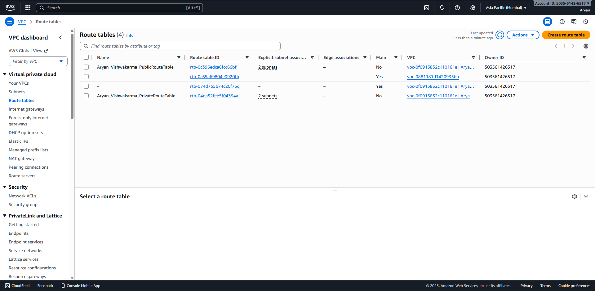
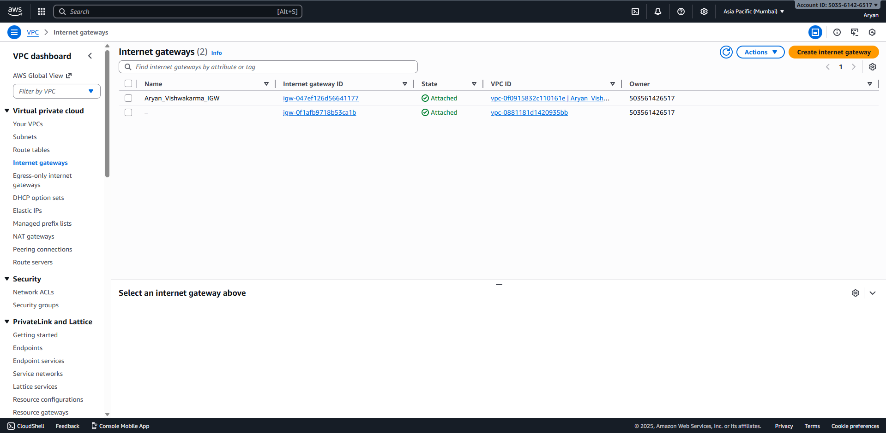

# Question 1 – Networking & Subnetting (AWS VPC Setup)

## Approach (4–6 lines)

I created a custom VPC with CIDR `10.0.0.0/16` to provide a large private IP range. Inside this VPC, I defined four `/24` subnets: two public (`10.0.1.0/24`, `10.0.2.0/24`) and two private (`10.0.3.0/24`, `10.0.4.0/24`) and spread them across two Availability Zones for better availability. The public subnets are connected to an Internet Gateway so that resources in them can have direct internet access. I placed a NAT Gateway in one public subnet and updated the private route table so that private subnets can reach the internet only via the NAT, keeping them isolated from direct inbound traffic. The entire setup is automated using Terraform.

## CIDR Ranges Used

- VPC: `10.0.0.0/16`
- Public Subnet 1: `10.0.1.0/24`
- Public Subnet 2: `10.0.2.0/24`
- Private Subnet 1: `10.0.3.0/24`
- Private Subnet 2: `10.0.4.0/24`

**Why these ranges?**  
`10.0.0.0/16` gives a large block that is easy to subnet in the future. `/24` subnets are simple to work with and provide enough IPs for typical application tiers. Separating public and private subnets makes it clear which resources can be exposed to the internet and which must stay internal. Distributing them across different Availability Zones improves resilience in case one AZ has issues.

## Screenshots

- VPC Overview (Aryan_Vishwakarma_VPC)
- Subnets list with all four CIDRs and AZs
- Public route table with default route to IGW
- Private route table with default route to NAT Gateway
- Internet Gateway and NAT Gateway configuration

(Place your images in an `images/` folder and link them, for example:)

## Terraform

All infrastructure for this question is defined in `main.tf` in this folder.
