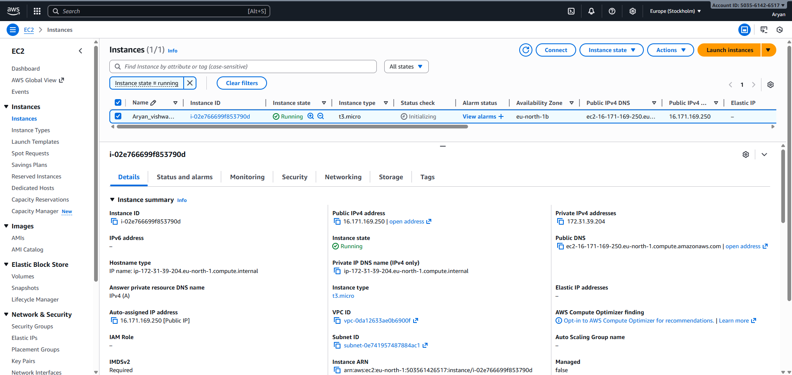
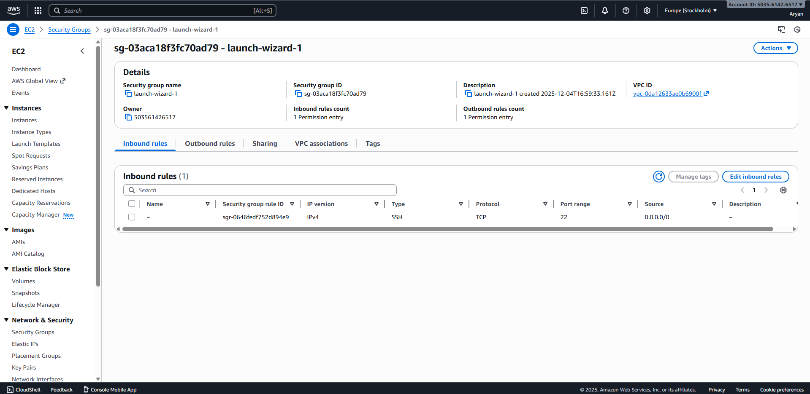

# Question 2 – EC2 Static Website Hosting

## Approach

I launched a Free Tier EC2 instance (Ubuntu 20.04) inside the public subnet created in Question 1. Using a user-data script, I installed Nginx automatically and deployed a static HTML resume page under `/var/www/html/index.html`. A security group was configured to allow HTTP (80) for public access and restrict SSH for administration. Basic hardening was applied including key-based login, limited security group rules, and restricted filesystem permissions. The site is accessible via the EC2 public IP on port 80.

## Hardening Steps Applied
- Only ports 80 and 22 kept open; SSH can be restricted to personal IP.
- Password authentication disabled by default on Ubuntu EC2.
- Nginx runs with restricted permissions; web root files owned by root.
- No IAM role attached to EC2 to reduce access surface.
- System packages updated to latest versions.

## Screenshots Needed
- EC2 instance details page

- Security group inbound rules

- Website opened in browser

## Terraform and User Data
- `main.tf` defines the EC2 instance, security group, and networking.
- `user_data.sh` installs Nginx and deploys the static site.
