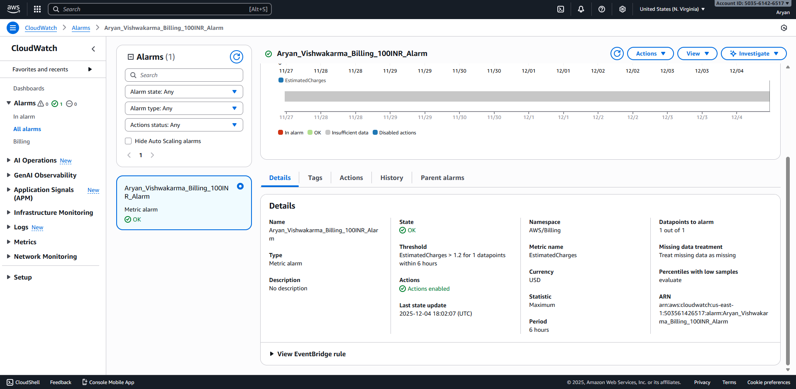

# Question 4 – Billing & Free Tier Cost Monitoring

## a) Why cost monitoring is important for beginners
Cost monitoring is essential for new AWS users because many services generate hourly charges even when they are not actively used. Beginners often leave resources such as EC2 instances, NAT Gateways, or load balancers running without realizing they are paid services. Billing alerts help prevent unexpected charges by notifying users when spending crosses safe limits. This builds good cloud habits and ensures safe experimentation within Free Tier limits.

## b) What causes sudden increases in AWS bills
Unexpected AWS bill increases are commonly caused by resources that are not Free Tier–eligible, such as NAT Gateways, ALBs, and Elastic IPs. Auto Scaling can also launch multiple instances unintentionally, increasing costs. Data transfer charges, unused EBS volumes, and running services in multiple regions further contribute to cost spikes. Monitoring helps catch these issues early and avoid large bills.

## Screenshots Required
- CloudWatch Billing Alarm set at ₹100 (≈1.20 USD)

- Free Tier Usage Alerts enabled under Billing Preferences

