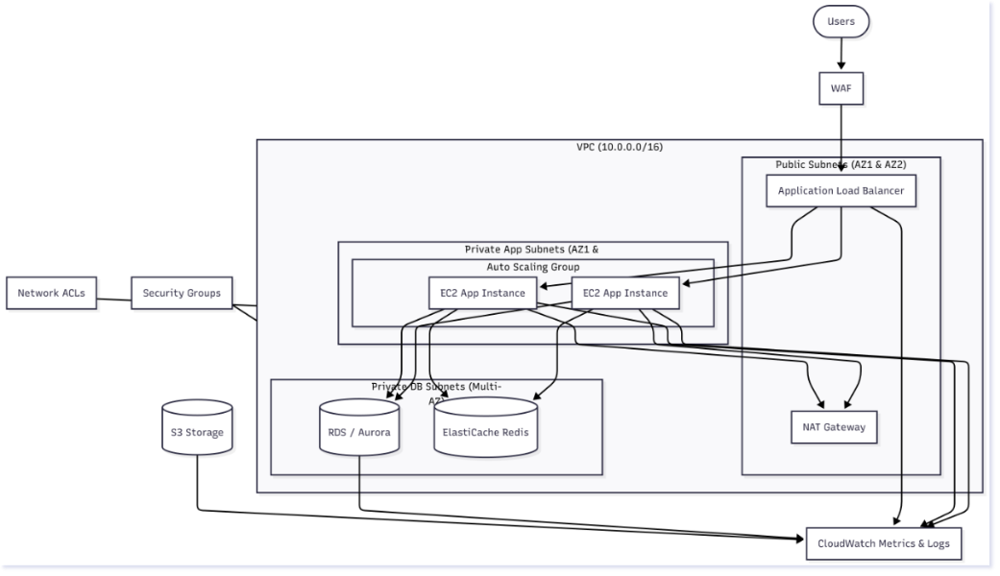

# AWS Architecture Diagram for 10,000 Concurrent Users

The diagram `flantas-aws-architecture.png` shows a highly available, scalable web application deployed across two Availability Zones. An internet-facing Application Load Balancer (optionally protected by AWS WAF) distributes incoming traffic to an Auto Scaling Group of stateless EC2 instances in private subnets. The application uses Amazon RDS/Aurora in Multi-AZ mode for relational data and Amazon ElastiCache for Redis to offload read traffic and handle sessions with low latency. Public and private subnets are protected with Security Groups and Network ACLs, while NAT Gateways provide secure outbound internet access from private instances. Monitoring and logging are enabled through Amazon CloudWatch, CloudWatch Logs, and optional VPC Flow Logs, and static assets or backups can be stored in Amazon S3.

